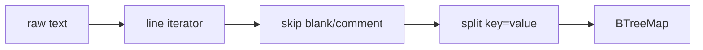

# HLD - Rust 配置解析库

## 架构

核心模块为 `src/lib.rs`。库不依赖外部 crate，使用标准库 `BTreeMap` 保持稳定输出顺序。

```mermaid
flowchart LR
    A["raw text"] --> B["line iterator"]
    B --> C["skip blank/comment"]
    C --> D["split key=value"]
    D --> E["BTreeMap"]
```

## 错误策略

返回 `Result<BTreeMap<String, String>, ConfigParseError>`，错误包含行号和原因。

